# 🍽️ Food Management System

A modern and responsive Food Management System developed using HTML, CSS, and JavaScript.

## 📌 Overview

The Food Management System helps users manage food-related activities through an interactive and responsive web interface.

## ✨ Features

- Responsive Design
- Modern User Interface
- Interactive JavaScript
- Easy Navigation
- User-Friendly Layout
- Fast Loading
- Mobile Friendly

## 🛠️ Technologies Used

- HTML5
- CSS3
- JavaScript

## 📂 Project Structure

```
Food-Management-System/
│── index.html
│── style.css
│── app.js
│── alerts.js
│── features.js
```

## 📸 Screenshots

### 🔐 Login Page

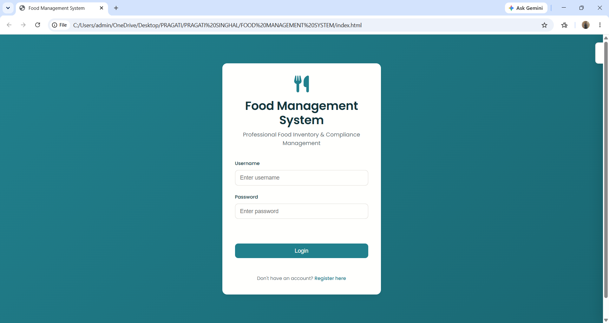

### 📝 Registration Page

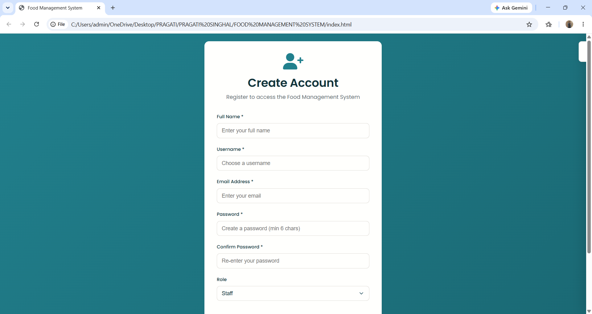

### 📊 Dashboard

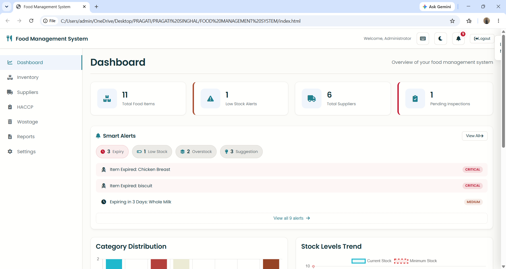

### 📦 Inventory Management

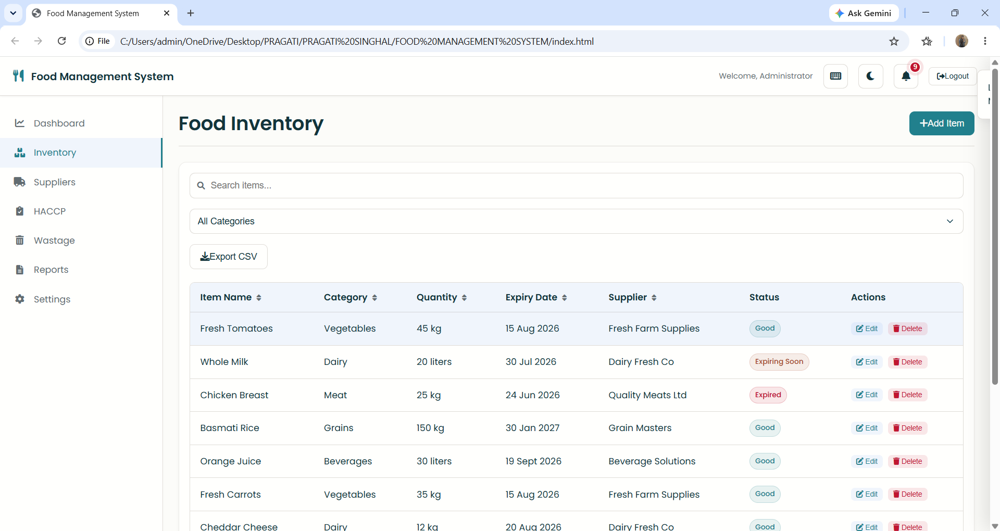

### 🚚 Supplier Management

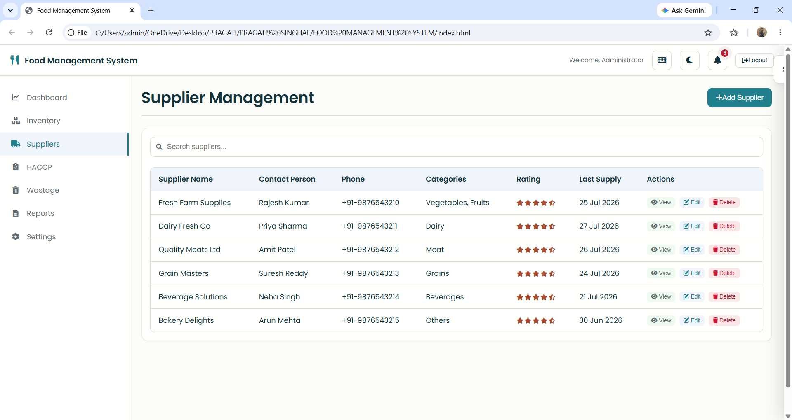

### 🧪 HACCP Management

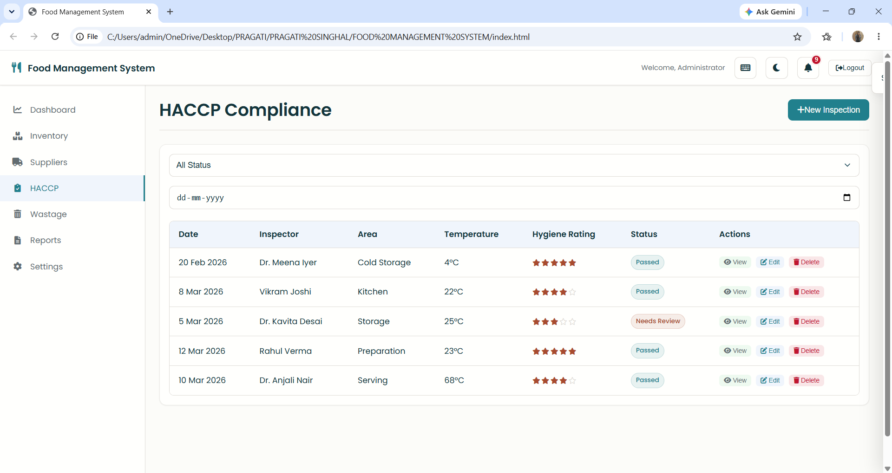

### 📈 Reports & Analytics

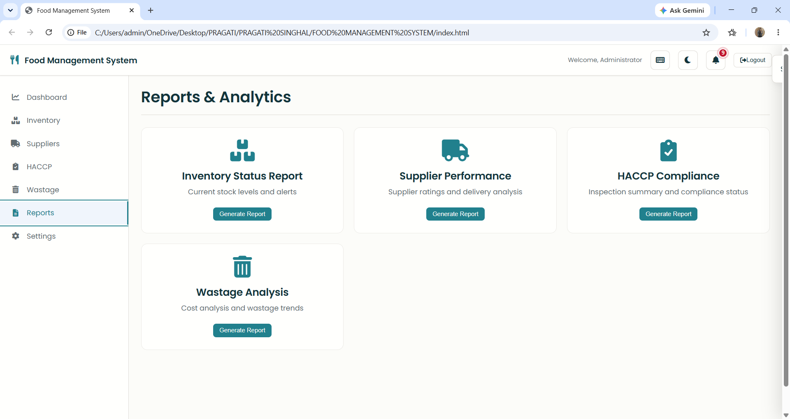

### 📉 Charts & Visualizations

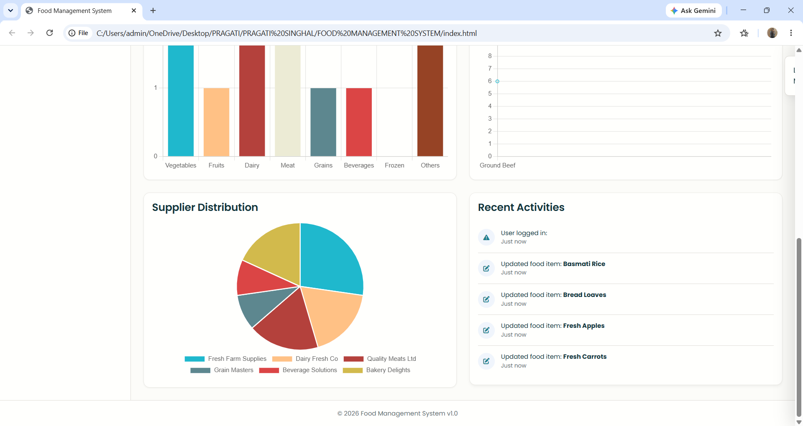

### 🚨 Alarm Alerts

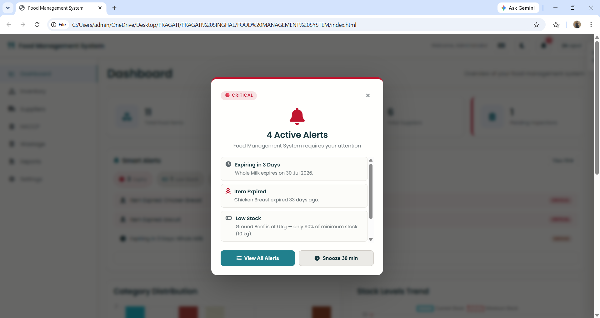

### 🔔 Notification Alerts

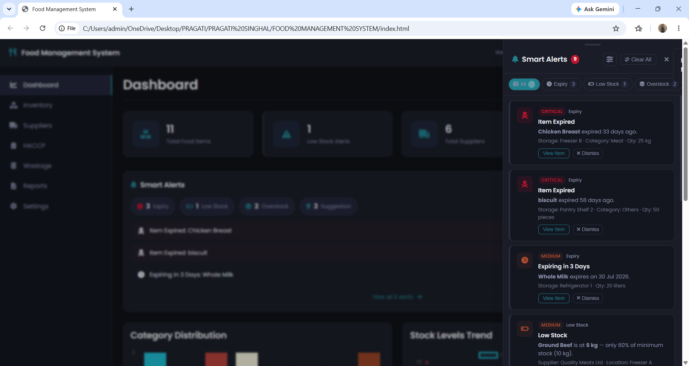

### 🗑️ Food Wastage Record

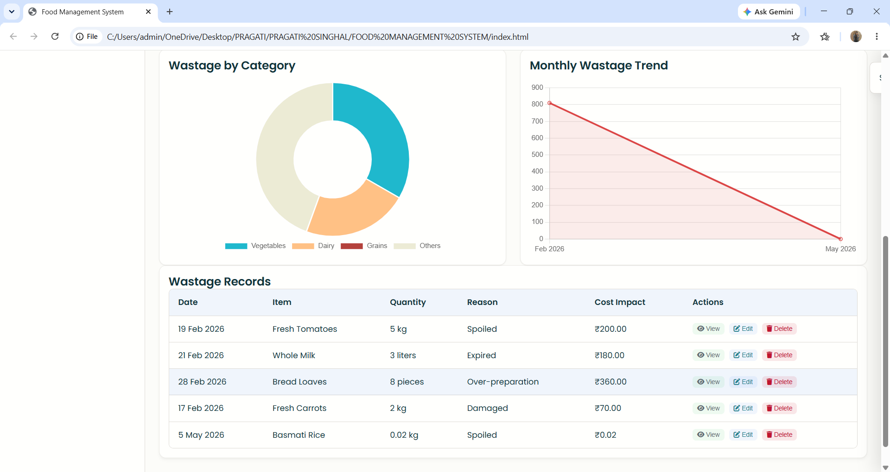

### 📋 Food Wastage Tracking

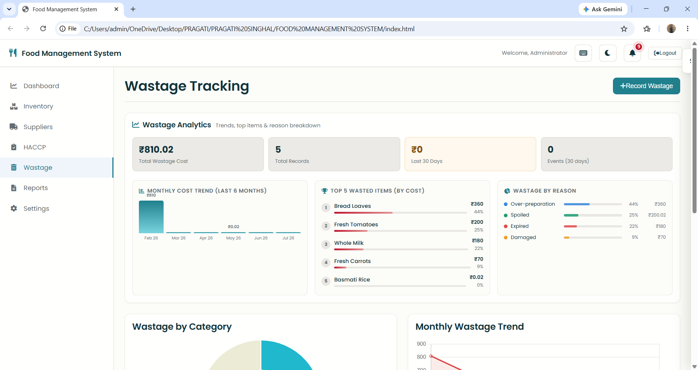

### 📑 Supplier Report

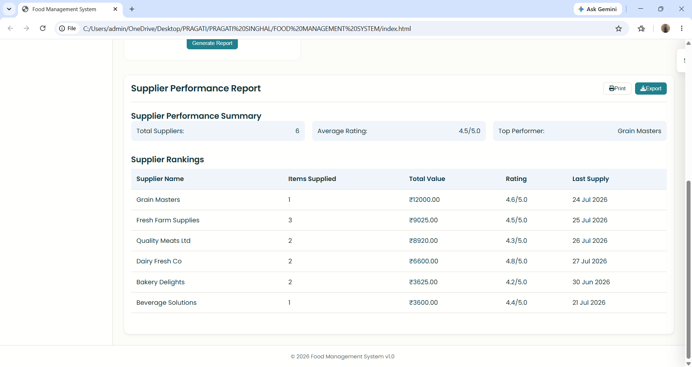

### ⚙️ Settings

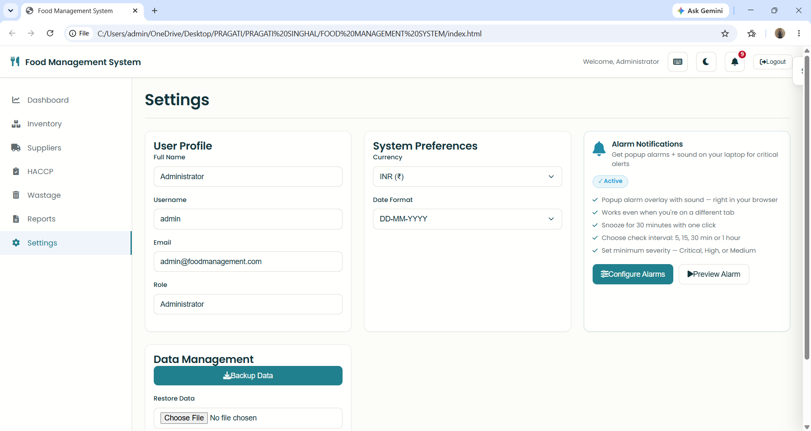

### ⌨️ Keyboard Shortcuts

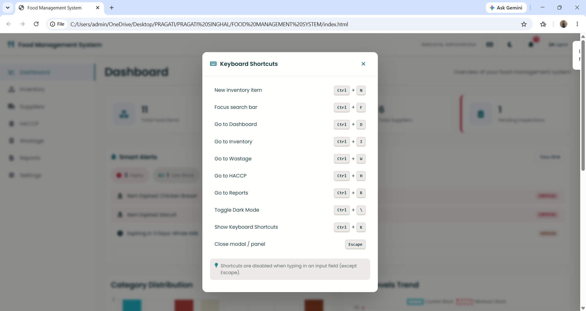

## 🚀 How to Run

1. Download the project.
2. Open the folder.
3. Double-click **index.html**

or

Open with **Live Server** in VS Code.

## 🌐 Live Demo

https://puser-p.github.io/food-management-system/

## 👩‍💻 Author

Pragati Singhal

## 📜 License

MIT License
